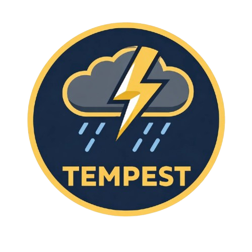

<div align="center">

  

  # Tempest

  **Une application météo élégante et minimaliste pour React Native**

  [](https://reactnative.dev/)
  [](https://expo.dev/)
  [](LICENSE)

  [Fonctionnalités](#-fonctionnalités) &bull;
  [Installation](#-installation) &bull;
  [Screenshots](#-screenshots) &bull;
  [Stack Technique](#-stack-technique) &bull;
  [Structure](#-structure-du-projet)

</div>

---

##  propos

**Tempest** est une application météo moderne développée avec React Native et Expo. Elle fournit des informations météorologiques en temps réel basées sur votre position géographique, avec une interface utilisateur élégante utilisant le design glassmorphism.

L'application récupère les données météorologiques grâce à l'API **Open-Meteo** (gratuite et open-source) et affiche les conditions actuelles ainsi que les prévisions sur 5 jours.

---

## Fonctionnalités

### Météo Actuelle
- Affichage de la température actuelle en temps réel
- Description des conditions météorologiques avec icônes adaptées
- Vitesse du vent
- Heures de lever et de coucher du soleil
- Différenciation jour/nuit avec icônes appropriées

### Géolocalisation
- Détection automatique de votre position via GPS
- Récupération du nom de votre ville en fonction de vos coordonnées
- Gestion élégante des permissions de localisation
- Fallback sur Paris si la localisation est refusée

### Prévisions à 5 Jours
- Navigation fluide vers l'écran des prévisions
- Températures minimales et maximales par jour
- Icônes météo pour chaque jour
- Affichage des noms des jours et dates

### Interface Utilisateur
- Design moderne avec effet glassmorphism
- Arrière-plan immersif avec images météo
- Horloge en temps réel
- Typographie personnalisée (Recursive font)
- Animations de transition fluides

## Stack Technique

### Core Framework
- **React Native** 0.81.5 - Framework mobile cross-platform
- **Expo** 54.0.32 - Plateforme de développement React Native
- **React** 19.1.0 - Bibliothèque UI
- **TypeScript** 5.9.3 - Typage statique

### Navigation
- **React Navigation** 7.1.28 - Navigation entre écrans
- **Native Stack Navigator** - Navigation native performante

### Styling
- **Tailwind CSS** 3.4.19 - Framework CSS utility-first
- **NativeWind** 4.2.1 - Utilisation de Tailwind dans React Native
- **Expo Font** 14.0.11 - Gestion des polices personnalisées

### Services & APIs
- **Expo Location** 19.0.8 - Géolocalisation
- **Open-Meteo API** - Données météorologiques gratuites
- **OpenStreetMap Nominatim** - Reverse geocoding pour les noms de villes

### Animations
- **React Native Reanimated** 4.1.0 - Animations natives performantes
- **React Native Worklets** 0.7.2 - Exécution de code sur le thread UI

---

## Installation

### Prérequis

Avant de commencer, assurez-vous d'avoir installé :

- **Node.js** (v18 ou supérieur) - [Télécharger](https://nodejs.org/)
- **npm** ou **yarn** - Gestionnaire de paquets
- **Expo CLI** - Globalement sur votre machine

```bash
npm install -g expo-cli
```

```bash
git clone https://github.com/votre-username/tempest.git
cd tempest
```

### Installer les Dépendances

```bash
npm install
```

---
## Lancement de l'Application

### Mode Développement (avec Expo Go)

La méthode la plus simple pour tester l'application :

1. Lancez le serveur de développement :
```bash
npx expo start
```

2. Scannez le QR code avec l'application **Expo Go** sur votre smartphone :
   - **Android** : Disponible sur [Google Play](https://play.google.com/store/apps/details?id=host.exp.exponent)
   - **iOS** : Disponible sur [App Store](https://apps.apple.com/app/expo-go/id982107779)

<div align="center">

  **Réalisé avec  using React Native & Expo**

  [Retour en haut](#-tempest)

</div>
